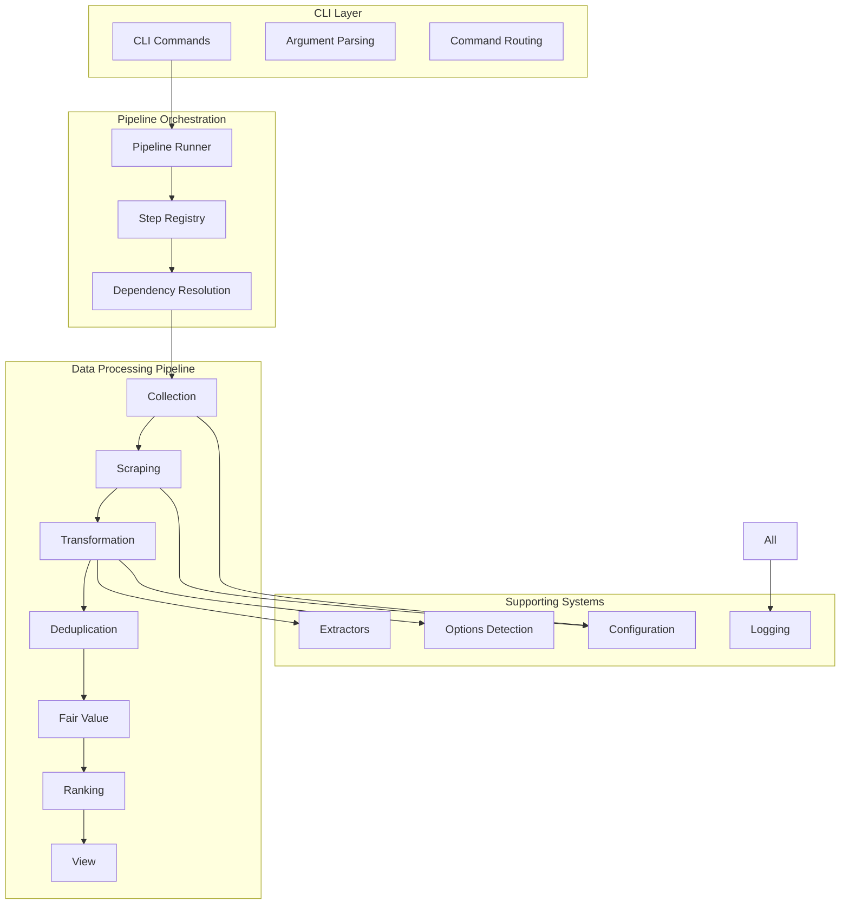

# View-from-CSV v4.5 Architecture Overview

## Executive Summary

The v4.5 codebase implements a **modular pipeline architecture** for vehicle data extraction and analysis, with clear separation of concerns and maintainable design. This overview helps new developers understand intent, structure, and scaling paths.

### Key Strengths ✅
1. **Clean modular architecture** with single-purpose modules
2. **Comprehensive pipeline orchestration** with dependency management
3. **Robust data extraction system** with confidence scoring
4. **Extensible options detection** with pattern-based matching
5. **Well-defined data contracts** between pipeline steps

### Key Considerations 🚀
- Maintain selector resilience; treat scrapers as replaceable profiles
- Monitor fair value parameters and adjust based on market movement
- Keep headful scraping behavior by default (configurable via CLI)

## High-Level Architecture



## Mission Alignment Verification

### 1. ✅ AutoTempest Ingestion
- **Status**: Implemented in collection step
- **Method**: Playwright-based web scraping with headful mode
- **Coverage**: AutoTempest search results → listing URLs
- **Quality**: Real-time scraping with validation

### 2. ✅ Per-Site Scraping
- **Status**: Implemented in scraping step
- **Method**: Uses collection step data (real, not mock)
- **Coverage**: Vehicle listing details extraction
- **Quality**: Data validation and quality scoring

### 3. ✅ Property/Option Extraction
- **Status**: Comprehensive implementation
- **Method**: Modular extractors + options detection
- **Coverage**: Year, price, mileage, model, colors, options
- **Quality**: Confidence scoring and validation

### 4. ✅ Fair Value Ranking
- **Status**: Implemented with configurable model
- **Method**: Base value + adjustments (year, model, mileage, colors)
- **Coverage**: Deal delta calculation and quality assessment
- **Quality**: Transparent calculation with metadata

### 5. ✅ Table View Presentation
- **Status**: Rich library-based display
- **Method**: Pipeline View Step (Enhanced View) – no HTML export
- **Coverage**: Ranked results with styling
- **Quality**: Professional formatting with theme support

## Component Architecture

### Pipeline Steps System
- **Base Classes**: `BasePipelineStep`, `StepResult`, `StepStatus`
- **Registry**: Automatic step discovery and dependency resolution
- **Runner**: Orchestrated execution with result tracking
- **Steps**: 7 core steps with clear interfaces

### Data Extraction System
- **Extractors**: Field-specific extraction with confidence scoring
- **Registry**: Dynamic module loading and management
- **Unified Interface**: Single point of access for all extractors
- **Pattern Matching**: Regex-based extraction with validation

### Options Detection System
- **Options**: 20+ vehicle option detectors
- **Categories**: Transmission, convenience, exterior, seating, technology, performance
- **Pattern Matching**: Text-based detection with value estimation
- **Registry**: Centralized options management

### Configuration System
- **Format**: TOML configuration files
- **Overrides**: Environment variable support
- **Validation**: Schema validation and error checking
- **Defaults**: Sensible defaults for all settings

## Data Flow Architecture

### Pipeline Data Contracts

#### Collection → Scraping
```python
# Input: List[Dict[str, Any]]
{
    'source_url': str,
    'listing_url': str,
    'title': str,
    'price': str,
    'year': str,
    'model': str,
    'mileage': str,
    'collection_timestamp': str,
    'scraping_method': str,
    'raw_text': str,
    'raw_html': str
}
```

#### Scraping → Transformation
```python
# Input: List[Dict[str, Any]]
{
    'scraping_id': int,
    'source_url': str,
    'listing_url': str,
    'title': str,
    'price': str,
    'year': str,
    'model': str,
    'mileage': str,
    'scraping_status': str,
    'raw_text': str,
    'extracted_data': Dict[str, Any]
}
```

#### Transformation → Deduplication
```python
# Input: List[Dict[str, Any]]
{
    'year': str,
    'year_confidence': float,
    'price': str,
    'price_confidence': float,
    'mileage': str,
    'mileage_confidence': float,
    'model_trim': str,
    'model_trim_confidence': float,
    'exterior_color': str,
    'interior_color': str,
    'data_quality_score': float,
    'options_list': str,
    'total_options_value': float
}
```

#### Fair Value → Ranking
```python
# Input: List[Dict[str, Any]]
{
    'fair_value_usd': float,
    'deal_delta_usd': float,
    'deal_quality': str,
    'fair_value_calculation': Dict[str, Any]
}
```

## Technical Implementation

### Web Scraping
- **Framework**: Playwright with Chromium
- **Mode**: Headful (configurable)
- **Anti-Detection**: User agent spoofing, header customization
- **Error Handling**: Timeout management, retry logic

### Data Processing
- **Language**: Python 3.10+
- **Dependencies**: Minimal external dependencies
- **Performance**: Streaming processing, configurable concurrency
- **Storage**: CSV output with timestamped files

### Configuration Management
- **Format**: TOML for human readability
- **Validation**: Schema-based validation
- **Environment**: Variable overrides for deployment
- **Defaults**: Comprehensive default values

## Risk Assessment

### High Risk Areas
1. **Web Scraping Fragility**: Site changes can break selectors
2. **Pattern Matching**: Regex patterns may become outdated
3. **Pricing Model**: Fair value assumptions may be incorrect

### Medium Risk Areas
1. **Pipeline Orchestration**: Dependency resolution complexity
2. **Dynamic Loading**: Module discovery failures
3. **Data Quality**: Extraction confidence scoring accuracy

### Low Risk Areas
1. **Configuration**: Well-validated and tested
2. **Logging**: Comprehensive error tracking
3. **CLI Interface**: Simple and stable

## Recommendations

### Immediate Actions (High Priority)
1. **Implement missing deduplication step**
2. **Add comprehensive error handling and retry mechanisms**
3. **Implement data validation schemas**

### Short-term Improvements (Medium Priority)
1. **Add comprehensive testing for pipeline steps**
2. **Implement monitoring and metrics collection**
3. **Add configuration validation for all pipeline steps**

### Long-term Enhancements (Low Priority)
1. **Consider async/await for better performance**
2. **Add caching layer for extracted data**
3. **Implement plugin system for new extractors**

## Conclusion

The 987 v4 codebase demonstrates **excellent architectural design** with clear separation of concerns, modular components, and maintainable code structure. The system successfully achieves its mission objectives with a robust pipeline architecture.

**Key strengths** include the modular pipeline system, comprehensive data extraction, and clean interfaces. **Critical gaps** exist in deduplication implementation and error handling, but these are addressable without major architectural changes.

The codebase follows **single-purpose module principles** and demonstrates **professional software engineering practices**. With the identified issues addressed, this system represents a **production-ready vehicle data analysis platform**.
