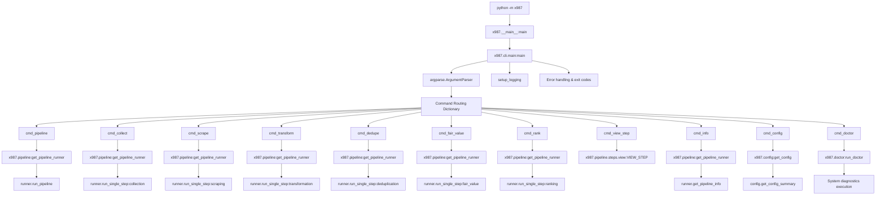

# CLI Command Structure Call Graph

## Overview
This call graph shows the CLI command structure and routing from argument parsing to individual command execution.

## Call Graph

## Command Details

### Pipeline Commands
- **`pipeline`**: Runs complete pipeline end-to-end
- **`collect`**: Runs only collection step
- **`scrape`**: Runs only scraping step  
- **`transform`**: Runs only transformation step
- **`dedupe`**: Runs only deduplication step
- **`fair_value`**: Runs only fair value calculation
- **`rank`**: Runs only ranking step

### Utility Commands
- **`view-step`**: Displays the final ranked view (Enhanced View) from the latest results
- **`info`**: Shows pipeline information and step details
- **`config`**: Shows configuration information
- **`doctor`**: Runs system diagnostics

## Common Dependencies

All commands depend on:
- `x987.config:get_config` - Configuration management
- `x987.utils.log:setup_logging` - Logging setup
- `x987.pipeline:get_pipeline_runner` - Pipeline orchestration

## Error Handling

- **KeyboardInterrupt**: Graceful cancellation with exit code 130
- **Command failures**: Return appropriate exit codes (0=success, 1=failure)
- **Unexpected errors**: Log error details and exit with code 1
- **Verbose mode**: Show full traceback for debugging

## Command Arguments

### Global Arguments
- `--headful`: Use headful mode for browser automation (default: True)
- `--verbose, -v`: Enable verbose logging

### Command-Specific Arguments
- `command`: Required command to execute (choices from command list)

## Exit Codes

- **0**: Success
- **1**: Command failure or unexpected error
- **130**: Keyboard interrupt (Ctrl+C)

## Logging

- **Default**: Info level logging
- **Verbose**: Debug level logging with full tracebacks
- **File logging**: Configured through `x987.utils.log:setup_logging`

## Configuration

- **Config file**: Loaded from TOML configuration
- **Environment variables**: Override config file values
- **Validation**: Configuration validated before use
- **Defaults**: Sensible defaults for all required values
