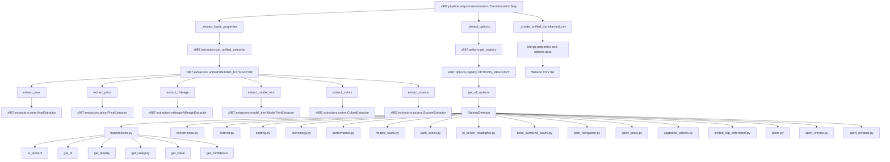

# Data Extraction and Options System Call Graph

## Overview
This call graph shows the modular data extraction and options detection system used in the transformation step.

## Call Graph



## Data Flow

### Property Extraction Flow
1. **Input**: Raw text from scraped listings
2. **Processing**: Each extractor processes text independently
3. **Output**: Extracted values with confidence scores
4. **Integration**: Unified extractor combines all results

### Options Detection Flow
1. **Input**: Raw text from scraped listings
2. **Processing**: Each option detector checks for presence
3. **Output**: Detected options with metadata and values
4. **Integration**: Options registry aggregates all results

## Extractor Contracts

### BaseExtractor Interface
```python
class BaseExtractor(ABC):
    @abstractmethod
    def extract(self, text: str) -> ExtractionResult:
        pass
```

### ExtractionResult Structure
```python
@dataclass
class ExtractionResult:
    value: Any
    confidence: float
    metadata: Dict[str, Any]
```

## Options Contracts

### BaseOption Interface
```python
class BaseOption(ABC):
    def is_present(self, text: str) -> bool: ...
    def get_id(self) -> str: ...
    def get_display(self) -> str: ...
    def get_category(self) -> str: ...
    def get_value(self, text: str) -> float: ...
    def get_confidence(self) -> float: ...
```

### Option Categories
- **Transmission**: Manual, Automatic, PDK
- **Convenience**: Comfort access, keyless entry
- **Exterior**: Bi-xenon headlights, sport exhaust
- **Seating**: Sport seats, heated seats
- **Technology**: PCM navigation, Bose audio
- **Performance**: PASM, sport chrono, limited slip differential

## Confidence Scoring

### Property Extraction Confidence
- **High (1.0)**: Clear pattern match with validation
- **Medium (0.7)**: Pattern match with some uncertainty
- **Low (0.3)**: Weak pattern match
- **Zero (0.0)**: No pattern found

### Options Detection Confidence
- **High (1.0)**: Multiple strong indicators present
- **Medium (0.7)**: Single strong indicator
- **Low (0.3)**: Weak or ambiguous indicators

## Error Handling

- **Missing extractors**: Graceful fallback with default values
- **Pattern failures**: Log warnings and continue processing
- **Invalid data**: Mark with low confidence scores
- **Registry errors**: Fall back to basic extraction

## Performance Considerations

- **Parallel processing**: Extractors can run independently
- **Caching**: Option patterns compiled once at startup
- **Memory usage**: Text content processed in streaming fashion
- **Scalability**: Linear scaling with number of listings

## Configuration

- **Extractor patterns**: Configurable regex patterns
- **Option definitions**: Configurable option metadata
- **Confidence thresholds**: Configurable quality filters
- **Fallback values**: Configurable default values

## Integration Points

- **Transformation step**: Main consumer of extraction results
- **Pipeline runner**: Orchestrates extraction execution
- **Configuration system**: Provides extraction parameters
- **Logging system**: Tracks extraction performance and errors
