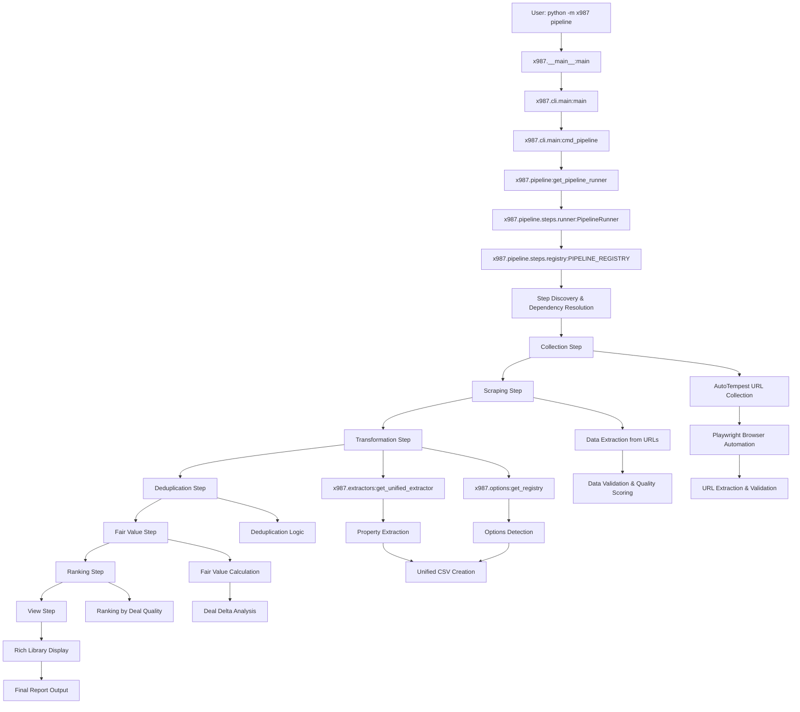

# Main Pipeline Flow Call Graph

## Overview
This call graph shows the main execution flow from CLI command to final data display, tracing through all pipeline steps.

## Call Graph

## Data Flow Contracts

### Collection → Scraping
- **Input**: List of search URLs from config
- **Output**: List of vehicle listing URLs with metadata
- **Data Structure**: `List[Dict[str, Any]]` with keys: `listing_url`, `title`, `price`, `year`, `model`, `mileage`

### Scraping → Transformation
- **Input**: Collection results with raw text and HTML
- **Output**: Scraped vehicle data with validation scores
- **Data Structure**: `List[Dict[str, Any]]` with keys: `raw_text`, `extracted_data`, `validation_status`

### Transformation → Deduplication
- **Input**: Transformed vehicle data with extracted properties and options
- **Output**: Normalized data with quality scores
- **Data Structure**: `List[Dict[str, Any]]` with keys: `year`, `price`, `mileage`, `model_trim`, `options_list`

### Deduplication → Fair Value
- **Input**: Deduplicated vehicle listings
- **Output**: Vehicle listings with fair value calculations
- **Data Structure**: `List[Dict[str, Any]]` with keys: `fair_value_usd`, `deal_delta_usd`

### Fair Value → Ranking
- **Input**: Vehicle listings with fair values and deal deltas
- **Output**: Ranked vehicle listings by deal quality
- **Data Structure**: `List[Dict[str, Any]]` with keys: `deal_quality`, `ranking_score`

### Ranking → View
- **Input**: Ranked vehicle listings
- **Output**: Formatted display and reports
- **Data Structure**: Rich library formatted output

## Key Dependencies

1. **Configuration**: All steps depend on `x987.config:get_config`
2. **Logging**: All steps use `x987.utils.log:get_logger`
3. **Extractors**: Transformation step depends on modular extractors system
4. **Options**: Transformation step depends on modular options system
5. **Playwright**: Collection and scraping steps depend on browser automation

## Error Handling

- Each step validates its inputs and dependencies
- Failed steps stop pipeline execution
- Results include success/failure status and error messages
- Logging provides detailed execution trace

## Performance Considerations

- Collection step uses polite delays between requests
- Scraping step supports configurable concurrency
- File I/O operations are batched where possible
- Memory usage scales with number of vehicle listings
